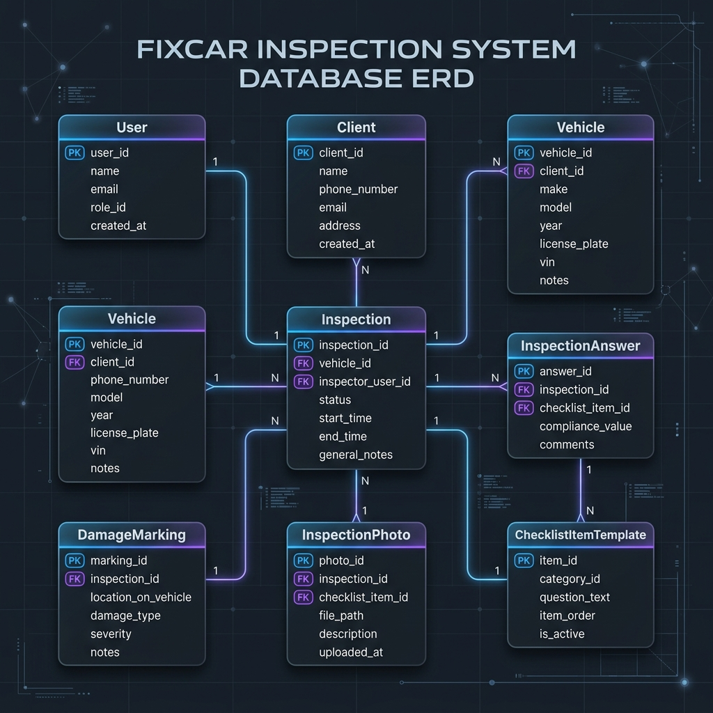

# 🚗 FixCar - Sistema de Inspeção e Checklist Veicular

Sistema completo fullstack para gestão, parametrização e digitalização de inspeções veiculares automotivas, controle de entrada e saída com assinatura digital, mapeamento interativo de avarias em Blueprint de carroceria, galeria de evidências fotográficas, dashboard analítico e controle de acesso baseado em perfis (RBAC).

---


## 🗄️ Justificativa da Escolha do Banco de Dados

Para este projeto, foi escolhido um **Banco de Dados Relacional (SQLite gerenciado via Prisma ORM)** pelas seguintes razões técnicas e de negócio:

1. **Necessidade e conhecimento**:
   - O banco de dados relacional foi escolhido devido a baixa complexidade de dados e relatorios e devido ao fato de eu possuo mais conhecimento neste tipo de banco de dados.

### 📊 Diagrama do Modelo Relacional (ERD)



---

## 🌐 Documentação da API REST

Todas as rotas da API (exceto o login) são protegidas por autenticação via **Header `Authorization: Bearer <token_jwt>`** ou cookie de sessão.

### 🔐 Autenticação
- `POST /api/auth/login` - Autentica usuário e retorna JWT com validade de 1 hora.
- `GET /api/auth/me` - Retorna dados e permissões do usuário logado.

### 📋 Inspeções e Vistorias
- `GET /api/inspections` - Lista vistorias com suporte a filtros (status, inspetor, termo de busca).
- `POST /api/inspections` - Criação atômica de nova vistoria completa (respostas, avarias, fotos, assinaturas).
- `GET /api/inspections/:id` - Retorna laudo completo de uma vistoria.
- `PUT /api/inspections/:id` - Atualiza dados ou registra saída do veículo com assinatura do cliente.
- `DELETE /api/inspections/:id` - Exclui vistoria (restrito a `ADMIN` e `GESTOR`).

### 👥 Clientes
- `GET /api/clients` - Lista clientes ativos (suporte a busca por nome, documento e telefone).
- `POST /api/clients` - Cadastra novo cliente.
- `GET /api/clients/:id` - Detalhes do cliente e histórico de veículos.
- `PUT /api/clients/:id` - Atualiza dados cadastrais.
- `DELETE /api/clients/:id` - Exclusão lógica (*Soft Delete* com `active: false`).

### 🚗 Veículos
- `GET /api/vehicles` - Lista veículos ou busca por placa específica.
- `POST /api/vehicles` - Cadastra novo veículo vinculado a um cliente.

### 👤 Usuários (Controle RBAC)
- `GET /api/users` - Lista usuários do sistema (exclusivo `ADMIN`).
- `POST /api/users` - Cria novo usuário com senha criptografada via bcrypt (exclusivo `ADMIN`).
- `GET /api/users/:id` - Consulta dados de usuário por ID (exclusivo `ADMIN`).
- `PUT /api/users/:id` - Atualiza dados/perfis ou redefine senha (exclusivo `ADMIN`).
- `DELETE /api/users/:id` - Soft Delete de usuário com proteção contra auto-exclusão (exclusivo `ADMIN`).

### ⚙️ Checklist & Uploads
- `GET /api/checklist-items` - Lista itens de parametrização do checklist oficial.
- `POST /api/checklist-items` - Cadastra novo item de inspeção (exclusivo `ADMIN`).
- `POST /api/upload` - Processa upload de fotos e assinaturas digitais, salvando em `/public/uploads`.
- `GET /api/dashboard/stats` - Retorna indicadores analíticos e distribuição gráfica de avarias.

---

## 🛠️ Como Executar o Projeto Localmente

### 1. Pré-requisitos
- Node.js 18+ instalado
- Git instalado

### 2. Passo a Passo

```bash
# 1. Clone o repositório
git clone git@github.com:PabloMarcondesGS/desafio_staff.git
cd desafio_staff

# 2. Instale as dependências
npm install

# 3. Configure as variáveis de ambiente (.env)
# O projeto já inclui valores padrão prontos para uso local:
# DATABASE_URL="file:./dev.db"
# JWT_SECRET="desafio-staff-secret-key-super-secure-2026"
# JWT_EXPIRES_IN="1h"
# O token foi programado para expirar em 1 hora, entao após uma hora de uso continuo e preciso relogar

# 4. Execute as Migrações do Banco de Dados
npx prisma migrate dev

# 5. Execute o Seed inicial para carregar dados e usuários de teste
node prisma/seed.js

# 6. Inicie o servidor de desenvolvimento
npm run dev
```

Abra seu navegador em: **`http://localhost:3000`**

---

## 🔑 Credenciais Padrão para Testes

| Perfil | E-mail | Senha | Nível de Acesso |
| :--- | :--- | :--- | :--- |
| **Administrador** | `admin@fixcar.com` | `admin123` | Acesso total: vistoria, gestão de usuários, parametrização, exclusão |
| **Gestor** | `gestor@fixcar.com` | `gestor123` | Acesso gerencial: visualização de laudos, clientes, veículos, dashboard |
| **Inspetor** | `inspetor@fixcar.com` | `inspetor123` | Operacional: execução de vistorias, registro de avarias, laudos e fotos |

Para facilitar foram adicionados botoes que preenchem os logins puramente para facilitar os testes.
